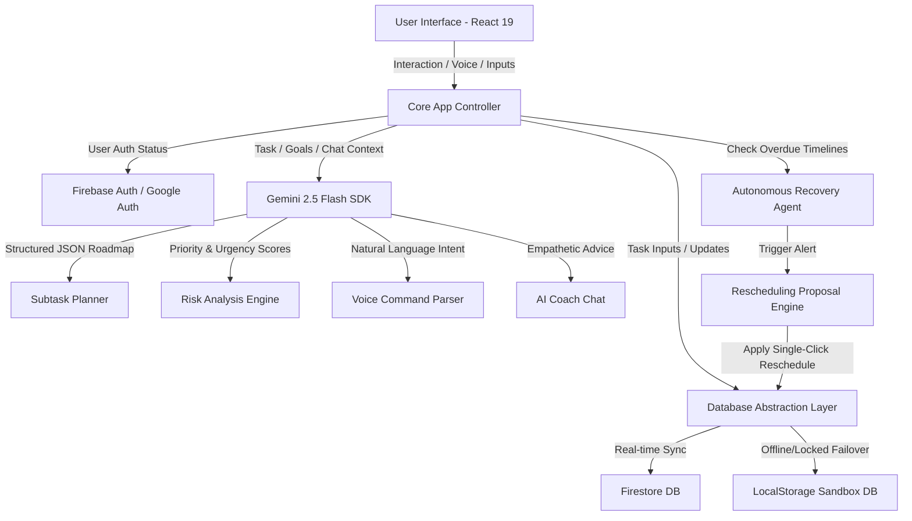

# 🛡️ Deadline Guardian AI — Technical Deep Dive
### *An Architectural Breakdown of a Proactive, Agentic Productivity System*

---

## 📌 Executive Summary
Traditional productivity systems are passive. They act as digital paper—recording lists and displaying alarms that users easily dismiss or snooze. This project, **Deadline Guardian AI**, is designed to bridge the gap between planning and execution. 

Built for the **Vibe2Ship Hackathon 2026**, it features an active agentic companion that decomposes complex tasks, predicts deadline risk scores, creates automated calendar time-blocks, and deploys an autonomous **Recovery Agent** when deadlines are missed.

---

## 🗺️ System Architecture



---

## 🧠 Deep Dive: Agentic Capabilities

### 1. AI Task Decomposition
When a user enters a complex task (e.g., *"Build React UI for Vibe2Ship"*), the application doesn't just save a text line. It initiates an asynchronous prompt to the **Gemini 2.5 Flash** model with a strict JSON output schema.

*   **Prompt Rules:** The model is instructed to divide the task into 3–5 logical, sequential subtasks, allocating realistic hourly estimates for each, and outputting an ordered list.
*   **JSON Schema Enforcement:** Using `responseSchema`, the Gemini API returns a structured object:
    ```json
    {
      "type": "object",
      "properties": {
        "subtasks": {
          "type": "array",
          "items": {
            "type": "object",
            "properties": {
              "title": { "type": "string" },
              "estimatedHours": { "type": "number" }
            },
            "required": ["title", "estimatedHours"]
          }
        }
      },
      "required": ["subtasks"]
    }
    ```

### 2. Predictive Compliance Risk Engine
Urgency is calculated dynamically by evaluating the workload remaining against the time available before the deadline:

$$\text{Workload Ratio} = \frac{\text{Total Estimated Hours Remaining}}{\text{Hours Remaining Until Deadline}}$$

Gemini reviews the workload ratio, task difficulty, and the user's overall productivity score to classify risk:
*   **Low Risk (Green):** $\text{Workload Ratio} \le 0.4$. The user has ample buffer.
*   **Medium Risk (Yellow):** $0.4 < \text{Workload Ratio} \le 0.8$. Requires focused scheduling.
*   **High Risk (Red):** $\text{Workload Ratio} > 0.8$. The deadline is mathematically at risk of failure. The coach offers specific advice (e.g., Pomodoro sessions, auto-scheduling) to mitigate this.

### 3. The Autonomous Recovery Agent
If a deadline passes and the task status remains incomplete, the **Recovery Agent** triggers upon dashboard entry:
1.  **Detection:** Runs an active filter checking if `task.deadline < new Date()` and `task.status !== 'completed'`.
2.  **Notification:** Renders a floating **Deadline Compliance Alert** to the right of the sidebar (`left-72`).
3.  **Autonomous Proposal:** Gemini formulates an empathetic explanation of the slip and generates a suggested action (e.g., *"We'll extend the deadline by 48 hours and bump the priority to High to help you catch up"*).
4.  **One-Click Execution:** The user clicks **Accept & Reschedule**, updating the database instantly and dispatching a custom refresh event.

### 4. Voice Command Intent Parser
Using the browser's **Web Speech Recognition API**, voice inputs are parsed by Gemini:
*   *Command:* "Create a task to write report by Friday high priority"
*   *Gemini Parsing Output:*
    ```json
    {
      "intent": "CREATE_TASK",
      "data": {
        "title": "Write report",
        "deadline": "2026-07-03T18:00:00Z",
        "priority": "high"
      }
    }
    ```
The controller maps the parsed intent to execute the database creation helper automatically.

---

## 💾 Data Modeling & Schema Design

### 📋 Collection: `tasks`
Stores task metadata, priority scores, and subtask trees.
```typescript
interface Task {
  id: string;
  userId: string;
  title: string;
  description: string;
  deadline: string; // ISO String
  priority: 'low' | 'medium' | 'high';
  estimatedHours: number;
  status: 'pending' | 'in_progress' | 'completed';
  aiGeneratedSubtasks: {
    id: string;
    title: string;
    estimatedHours: number;
    status: 'pending' | 'completed';
  }[];
  createdAt: string; // ISO String
}
```

### 📅 Collection: `plans`
Schedules tasks into time blocks.
```typescript
interface Plan {
  planId: string;
  userId: string;
  generatedSchedule: {
    date: string; // YYYY-MM-DD
    timeBlocks: {
      startTime: string; // HH:MM
      endTime: string;   // HH:MM
      taskId: string;
      subtaskId: string;
      taskTitle: string;
      subtaskTitle: string;
    }[];
  }[];
  progress: number; // 0.0 - 1.0
  updatedAt: string;
}
```

---

## 🛡️ Database Abstraction & Fail-safe Mode
To ensure the app always works seamlessly during evaluation (even if Firebase credentials are missing or remote Firestore database rules are locked), a custom wrapper layer is defined in `firebase.js`:

```javascript
// Example Fail-safe abstraction wrapper
export const createDocument = async (col, data) => {
  if (isLocalFallback || isGuestUser()) {
    return localDb.addDoc(col, data);
  }
  try {
    return await addDoc(collection(db, col), data);
  } catch (error) {
    console.warn("Firestore write failed, falling back to LocalStorage:", error);
    return localDb.addDoc(col, data);
  }
};
```
*   **Significance:** If the production database experiences a permission block, the application silently redirects the write/read to `LocalStorage` in real-time, resulting in **zero app crashes** or failed user sessions.

---

## 🎨 Design System: "Ocean Breeze"
The visual identity follows a premium SaaS approach tailored to light-mode productivity:

*   **Palette:**
    *   `Background`: `#F8FAFC` (Clean light background)
    *   `Primary (Sky Blue)`: `#0EA5E9` (Main interactive elements)
    *   `Secondary (Cyan)`: `#06B6D4` (Gradients and hover states)
    *   `Accent (Teal)`: `#14B8A6` (Success badges and AI indicators)
    *   `Dark Navy`: `#0F172A` (Sidebar background and text headings)
*   **Components:** Styled using glassmorphism cards (`rgba(255, 255, 255, 0.85)` with `backdrop-filter: blur(20px)`) and rounded corners (`16px`).
*   **Transitions:** Uses Framer Motion for card entry and tab navigations, creating a highly premium, animated feel.
